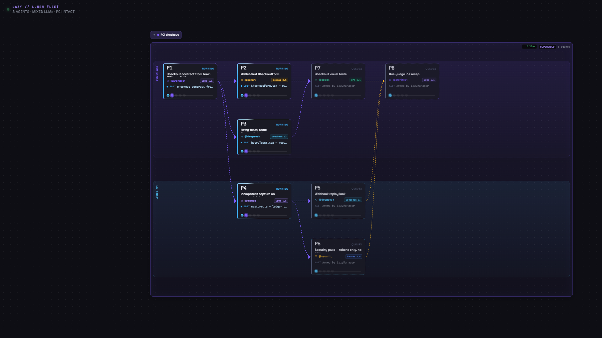
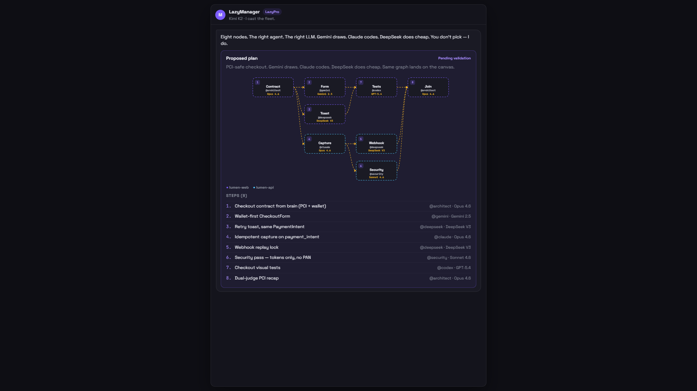
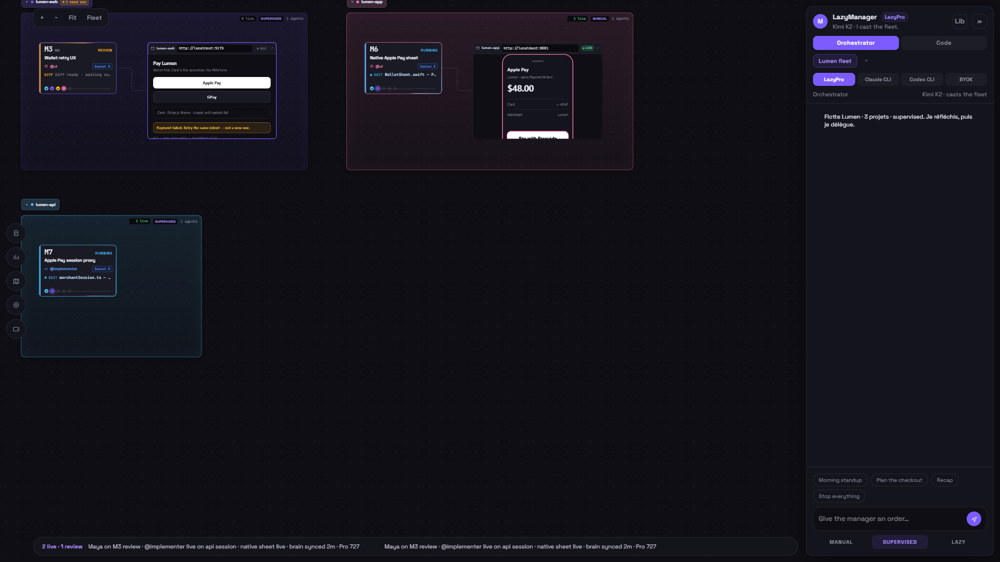
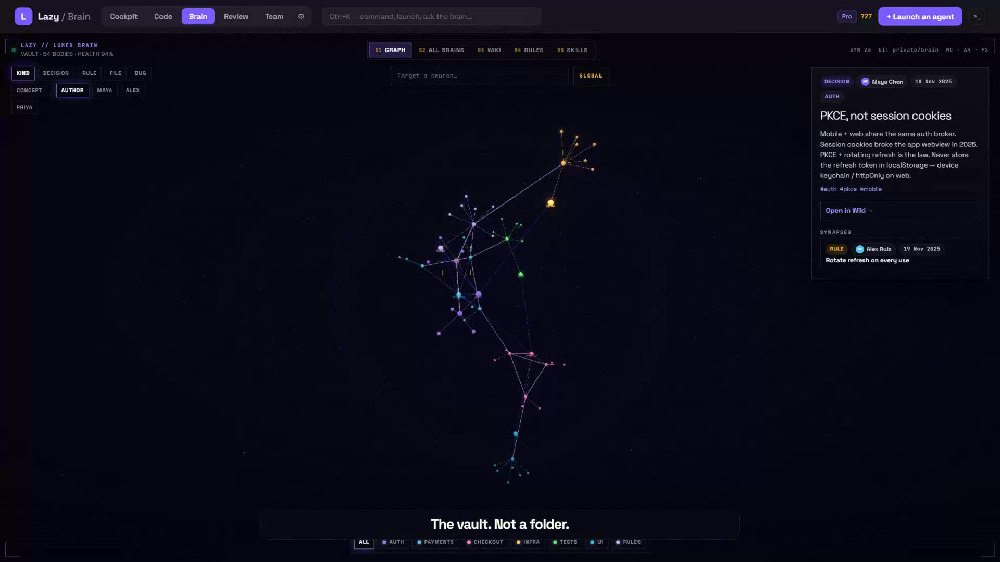
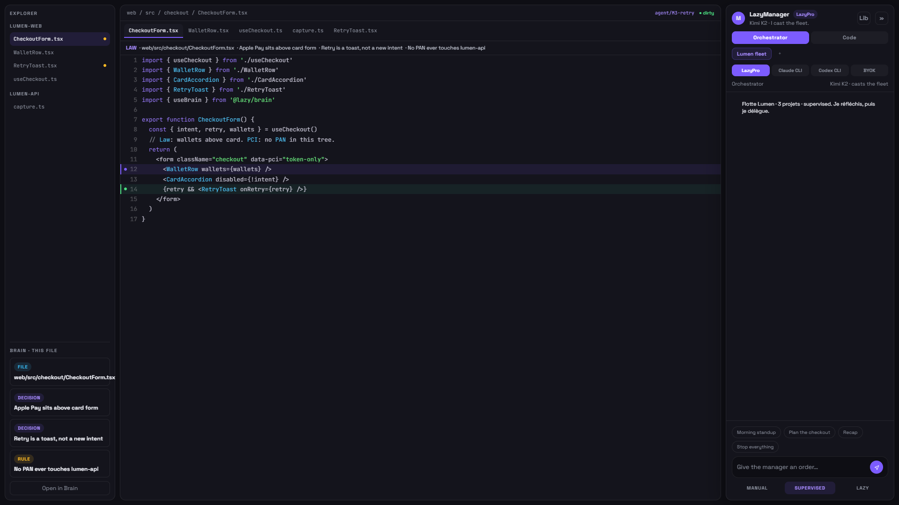
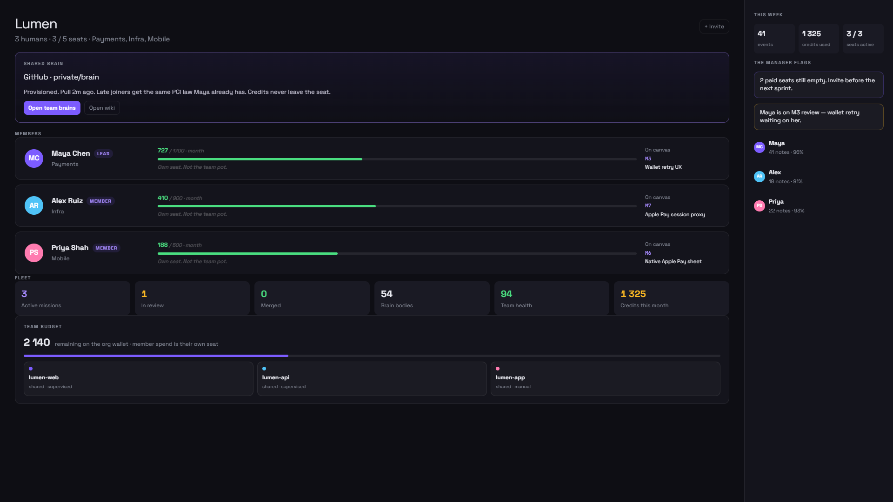

<div align="center">

# Lazy

**The AI coding environment for lazy people.**

One **LazyManager**. It understands what you want, plans the work, and
delegates to agents, bots, and models. A **frontier model** does the thinking;
**cheaper models** (like DeepSeek) do the grunt work. You stay lazy.

[What is Lazy?](#what-is-lazy) · [Quick start](#quick-start) ·
[Features](#features) · [Models](#models) · [Tech stack](#tech-stack) ·
[Contributing](#contributing) · [License](#license)

<br/>



</div>

---

## What is Lazy?

Lazy is an IDE/harness where you talk to **one AI manager** and it does all the
work for you. Instead of juggling 10 tools, hopping between terminals, and
losing context at every session, you talk to the LazyManager and it delegates
to agents, LLMs, and LazyBots.

No more staring at a terminal wondering what your agent is doing. No more
re-explaining your project to a new chat. **Lazy remembers everything.**

## Quick start

```bash
npm start
```

One command installs everything and launches the app. On first launch, create
a free account — or skip it and use your own keys.

> **Manual setup** (if `npm start` doesn't work):
>
> ```bash
> npm run setup       # Install deps + build engine
> npm run tauri dev   # Launch the desktop app
> ```
>
> Requirements: **Node 20.12+**, **Rust** (<https://rustup.rs/>)

## Features

### LazyManager



Your AI project manager. One chat panel, two modes:

- **Orchestrator** — "Create an agent that reviews PRs", "Launch
  @security-reviewer on the auth module", "Loop lint check every 15m". It
  creates agents, launches missions, sets up loops, and delegates the work.
- **Coder** — direct coding help with the active model.

The manager floats on the right edge, always in reach — you never lose your
conversation.

**Why it's cheap:** the manager runs on a **frontier model** for the thinking
and hands the repetitive work to **cheaper models** (e.g. DeepSeek). You get
frontier judgment without paying frontier prices on every token.

### Cockpit / Canvas



If you use AI agents today, you're probably staring at a terminal: output
scrolling everywhere, no idea who's working on what or what failed. That
sucks.

The Cockpit fixes it with a **visual canvas** where every mission, agent, and
bot is a node:

- **Mission nodes** — live status, cost, agent output, who's on it
- **Project groups** — organize missions per project
- **Loop nodes** — recurring tasks on a schedule
- **Router nodes** — dispatch work to the right agent automatically
- **LazyBot nodes** — bots running their own routines

Instead of reading terminal soup you see the whole fleet at a glance, drill
into any node, and approve or reject work right from the canvas.

### Brain



Persistent memory that survives sessions — a **3D neural graph** where every
neuron is a piece of knowledge (decisions, patterns, code context, rules).

- **3D graph** — navigate your project's memory spatially
- **Wiki** — read and edit neuron notes in markdown
- **Timeline** — travel back through your brain's history
- **Rules & Skills** — coding standards injected into every agent prompt
- **HTML export** — neurons use standard HTML tags (`<neuron>`, `<relation>`),
  so the export is a **real navigable site, not a dump**. Host it, share it,
  back it up.
- **Team brain** — the same brain is shared across the whole team

The brain builds itself while you work, so the next session starts exactly
where the last one stopped.

### Code



A multi-project code workspace: file explorer, CodeMirror editor with tabs,
and the LazyManager docked on the right.

- Multi-project sidebar with worktrees and brain
- Live worktree view showing what agents are changing right now
- Real diff drawer to review agent changes inline

### Review

Pending diffs from agent work. Real git diffs — never fake data. See exactly
what agents changed before you approve, with per-change risk and reviewer
verdicts.

### LazyBots

Autonomous bots that run their own routines, similar to Grok bots.

- Create bots with custom system prompts and capabilities
- Schedule routines for recurring tasks
- Teach by demonstration — show once, they repeat
- Bot-to-bot handoffs for multi-step workflows
- Browser automation via **Solari** — bots can navigate sites, fill forms, and
  interact with web apps (the Solari API key is stored in the OS keychain,
  never in a file)
- Share bots via deep-link encoding

### Team



A shared workspace for teams. The view adapts to your role — solo, lead,
member, or multi-team — and the Team Brain shares the same memory across
everyone.

## Models

Three ways to run:

1. **Create a Lazy account** — sign up in the app, take a **LazyPro**
   subscription for managed models (Claude, GPT) with transparent per-token
   pricing.
2. **BYOK** — bring your own key (Anthropic, OpenAI, OpenRouter, DeepSeek, …).
   No account needed.
3. **Use your existing subscription** — already paying for Claude or ChatGPT?
   Use the `claude` CLI or your API key directly.

No lock-in. No forced plan. Use what works for you.

## Build installers

```bash
npm run tauri build
```

Produces NSIS + MSI installers. Bundles Node + LazyBrain — end users install
nothing extra.

## Tech stack

Tauri 2 (Rust) · React + Vite + TypeScript + Tailwind v4 · CodeMirror 6 ·
xterm.js · three.js · React Flow · Node sidecar (LazyBrain)

## Contributing

Pull requests are welcome. For bigger changes, open an issue first. Please
keep tests updated — see [CONTRIBUTING.md](./CONTRIBUTING.md).

## Security

Found a vulnerability? Report it privately — see [SECURITY.md](./SECURITY.md).

## License

[FSL-1.1-ALv2](./LICENSE.md) — source-available. Use it at work, fork it, run
it. Don't sell a competing product. Becomes Apache-2.0 after two years.

