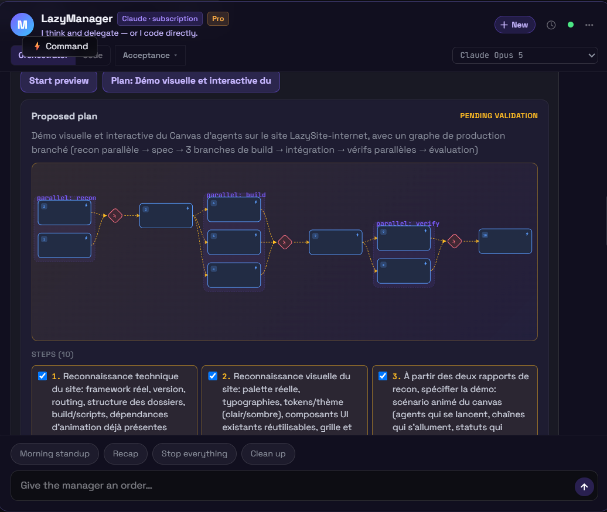
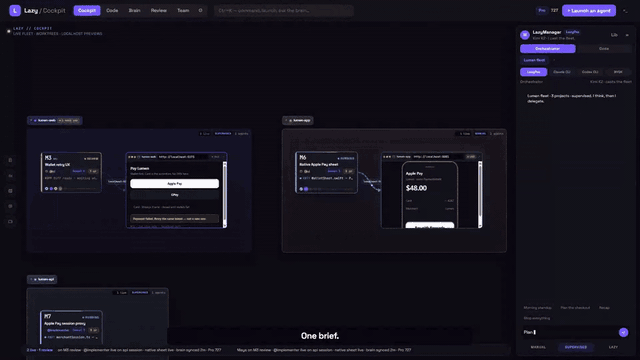
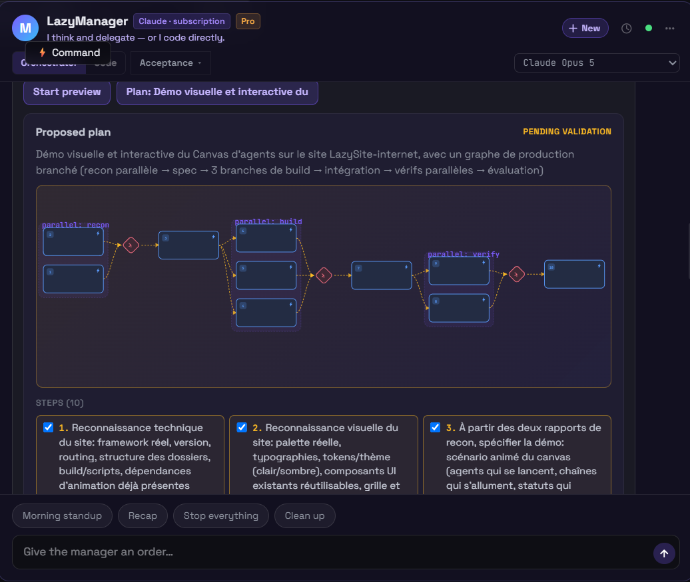
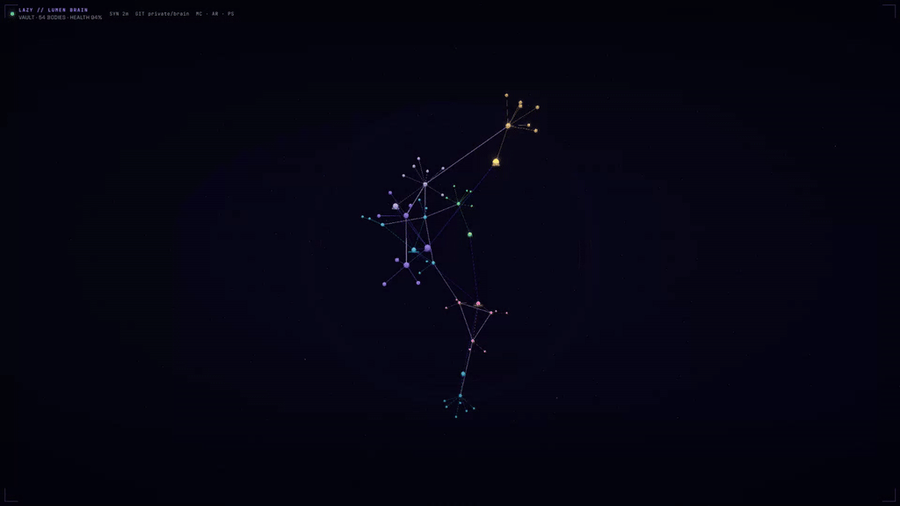
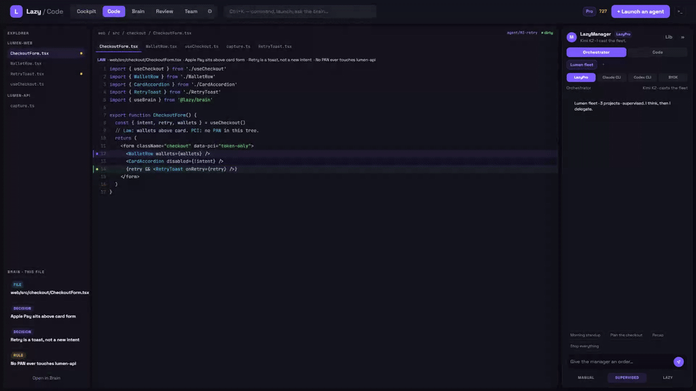
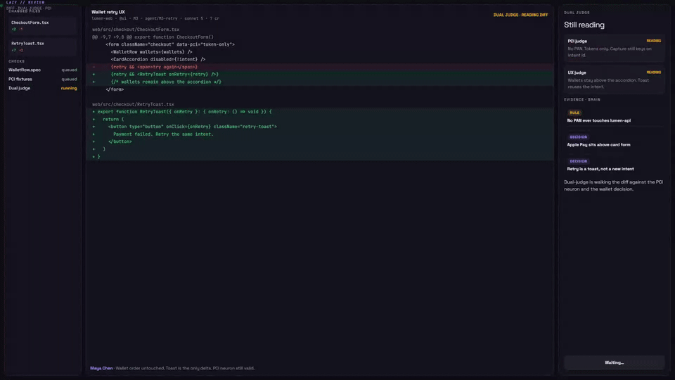
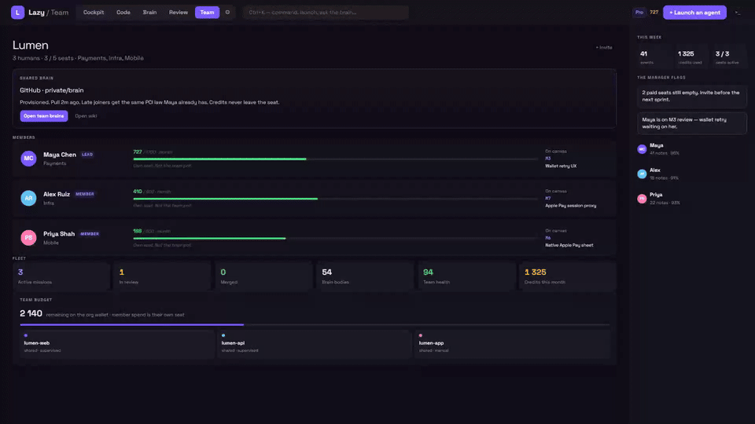
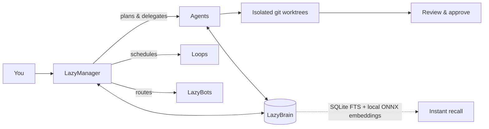

# Lazy

**be lazy, work less, produce more**

One **LazyManager**. It plans and delegates. Agents code. LazyBots run the routines.
A frontier model does the thinking; cheaper models do the grunt work. You stay the strategist.

[](https://github.com/LazyGod75/The-LazyIDE/actions/workflows/ci.yml)
[](./LICENSE.md)
[](#build-installers)
[](./CONTRIBUTING.md)

[What is Lazy?](#what-is-lazy) · [Quick start](#quick-start) ·
[Features](#features) · [How it works](#how-it-works) ·
[Models](#models) · [Contributing](#contributing) · [License](#license)



<details>
<summary>Watch a short demo</summary>

<video src="public/readme/demo-light.webm" poster="public/readme/hero-poster.png" width="100%" controls playsinline muted>
  
</video>

[GIF fallback](public/readme/demo-light.gif) if the video does not play.

</details>

---

## What is Lazy?

Lazy is an IDE/harness where you talk to **one AI manager** and it does all the
work for you. Instead of juggling 10 tools, hopping between terminals, and
losing context at every session, you talk to the LazyManager and it delegates
to agents, LLMs, and LazyBots.

You brief it like a colleague: *"review my PRs every morning"*, *"keep the
test suite green"*, *"port this module to Rust"*. It plans, spawns
missions in isolated worktrees, reviews the diffs, and reports back on a live
canvas. Every decision, pattern, and bug it touches lands in a **persistent
Brain** your whole fleet shares, so tomorrow's session starts where today's
ended, not from a cold prompt.

No more staring at a terminal wondering what your agent is doing. No more
re-explaining your project to a new chat. **Lazy remembers everything.**

## Why not just use Claude Code / Cursor / Devin?

| | Claude Code / Cursor / Devin | Lazy |
|---|---|---|
| Mental model | You drive the agent | You brief a manager; it drives the fleet |
| Visibility | Terminal scrollback | Live canvas: every mission is a node with status, cost, output |
| Memory | Per-session / per-repo docs | Persistent Brain: decisions, patterns and rules captured and reused |
| Models | One vendor | Frontier for thinking, cheap models for grunt work, BYOK or your existing CLI subscription |
| Repetitive work | Re-prompt every time | Loops and LazyBots run routines on a schedule |
| Team context | Shared docs drift | One Team Brain shared by everyone |

## Quick start

### Desktop build

Installers ship via [Releases](https://github.com/LazyGod75/The-LazyIDE/releases) when published (Windows / macOS / Linux). Until then, run from source below.

### From source

```bash
npm start
```

One command installs dependencies and launches the app. On first launch, create a free account, or skip and use your own keys (BYOK).

> **Manual setup** (if `npm start` doesn't work):
>
> ```bash
> npm run setup      # Install deps + build engine
> npm run tauri dev  # Launch the desktop app
> ```
>
> Requirements: **Node 20.12+**, **Rust** ([rustup](https://rustup.rs/)). On Windows you also need MSVC C++ Build Tools.

## Features

### LazyManager



You don't prompt agents one by one. You brief the LazyManager like a
colleague: *"rewrite the checkout to be PCI-safe, wallets first"*. It reads
the Brain, then drafts a plan you can actually see: a numbered graph with
parallel branches, join points where the work merges back, and each step
already carrying its agent, its model, and its credit cost. You edit,
approve, or reject. On validate, the exact same graph materializes on the
canvas as running missions, and the manager keeps supervising: it reassigns
stuck work, retries flaky steps, and only escalates to you when a real
judgment call is needed.

Two modes: **Orchestrator** delegates ("create an agent that reviews PRs",
"loop the lint check every 15m"), **Coder** pairs with you directly. The
manager runs on a **frontier model** for judgment and hands execution to
**cheaper models** like DeepSeek, so a full fleet costs less than one
premium chat session.

### Cockpit / Canvas

If you run AI agents today, you are probably staring at a terminal: output
scrolling everywhere, no idea who is doing what or what just failed. The
Cockpit replaces that with a **live graph**: every mission is a node inside
a project zone, edges flow in the direction work travels, and diamonds mark
the points where parallel branches merge.

Each card shows what matters at a glance: a rotating status ring, the stage
rail (plan → code → test → review → merge), the agent, the model, and the
live credit burn. Your dev server is a node too: the canvas pins a real
**localhost preview** next to the agent currently editing it, so you watch
the checkout page change instead of reading a log. Drill into any node,
approve or reject work right from the canvas.

### Brain



Every agent session ends the same way: everything it learned evaporates.
Brain is the fix. It is a persistent project memory stored on disk as
**plain HTML files**, one neuron per piece of knowledge: a decision, a rule,
a file's role, the root cause of a bug. After each conversation, the manager
extracts what mattered and writes it into neurons enriched with semantic
markup: facts, insights, topics, linked files, an author, a timestamp.
Knowledge compounds instead of resetting.

Why HTML? Because a neuron is a document, not a blob. You can open your
entire brain in a browser and read it as a real navigable site, grep it,
diff it in git, host it, share it. No proprietary format, no black box: the
memory of your project stays yours and stays readable by humans, not just
the model.

Recall is **deterministic**. Neurons are indexed locally (SQLite FTS5 plus
ONNX embeddings) and `lazybrain inject-context` resolves a query to the
same bounded context every single time. No lottery, and no more stuffing
ten thousand lines of history into a prompt hoping the model notices the
one rule on line 6,412. Agents start each session already knowing your
law, and the injected context is small enough to stay fast and cheap.

The result is a fleet that compounds: a PCI rule learned in March is still
enforced in September, by every agent, on every session, without you
repeating it. The 3D view makes the memory tangible: navigate clusters
spatially, open a neuron to see who wrote it and why, flip to the wiki to
edit the law directly, or travel the timeline back through your brain's
history.

### Code



A real multi-project workspace, not a viewer. File explorer, CodeMirror
editor with tabs, worktrees per agent, and the LazyManager docked on the
right so context is always one keystroke away. The connection runs both
ways: open a file and the Brain shows which neurons govern it; open a
neuron and you can jump to the code it protects. A live worktree view shows
what agents are changing right now, and a real diff drawer lets you review
agent edits inline before anything lands.

### Review



Agent work never merges in the dark. Every mission lands in Review as a
**real git diff**, never a summary or fake data. Two independent judges read
the change against the Brain's law and return verdicts with per-change risk
callouts. You see exactly what the fleet changed, you approve when you are
convinced, and the merge to main is one click. Supervised mode means nothing
ships without your eyes; autonomy is a dial you control per project, not a
leap of faith.

### LazyBots

Agents wait for missions. **LazyBots** run their own routines on a schedule:
morning PR sweeps, nightly regression passes, dependency audits, web checks.
Create a bot with a custom system prompt and capabilities, teach it by
demonstration once, and it repeats the routine while you sleep. Bots hand
off to each other for multi-step workflows, and through **Solari** they get
real browser automation: navigate sites, fill forms, scrape, operate.
The Solari key lives in the OS keychain, never in a file, and bots are
shareable by deep link.

### Team



Team turns the whole setup into shared infrastructure. Seats come with
credit pools: the lead allocates budgets per member and per project, invites
land by link, and the view adapts to your role (solo, lead, member, or
multi-team). The real multiplier is the **Team Brain**: every member's
fleet reads and writes the same memory, so the rule a senior set in January
is already inside the intern's agent in July. One law for everyone, no
tribal knowledge, no "ask Maya why we never store PANs". New teammates
inherit the project brain on day one instead of absorbing it over months.

## How it works



The desktop app is a **Tauri 2** shell (Rust) around a React UI. The brain is a
**Node sidecar** (`lazybrain`): notes are human-readable HTML files on disk,
indexed in SQLite FTS5 with local ONNX embeddings. Your knowledge never
leaves your machine unless you choose a hosted brain.

<div align="center">

</div>

## Models

Three ways to run:

1. **Create a Lazy account**: sign up in the app, take a **LazyPro**
   subscription for managed models (Claude, GPT) with transparent per-token
   pricing.
2. **BYOK**: bring your own key (Anthropic, OpenAI, OpenRouter, DeepSeek, …).
   No account needed.
3. **Use your existing subscription**: already paying for Claude, ChatGPT,
   or Devin? Use the `claude`, `codex`, or `devin` CLI directly; Lazy
   detects whichever is installed and logged in.

No lock-in. No forced plan. Use what works for you.

## Build installers

```bash
npm run tauri build
```

Produces NSIS + MSI installers. Bundles Node + LazyBrain, so end users install
nothing extra.

## Tech stack

Tauri 2 (Rust) · React + Vite + TypeScript + Tailwind v4 · CodeMirror 6 ·
xterm.js · three.js · React Flow · Node sidecar (LazyBrain) · SQLite FTS5 +
ONNX embeddings

## Contributing

Pull requests are welcome. For bigger changes, open an issue first. Please
keep tests updated; see [CONTRIBUTING.md](./CONTRIBUTING.md).

## Security

Found a vulnerability? Report it privately; see [SECURITY.md](./SECURITY.md).

## License

[FSL-1.1-ALv2](./LICENSE.md): source-available. Use it at work, fork it, run
it. Don't sell a competing product. Becomes Apache-2.0 after two years.
