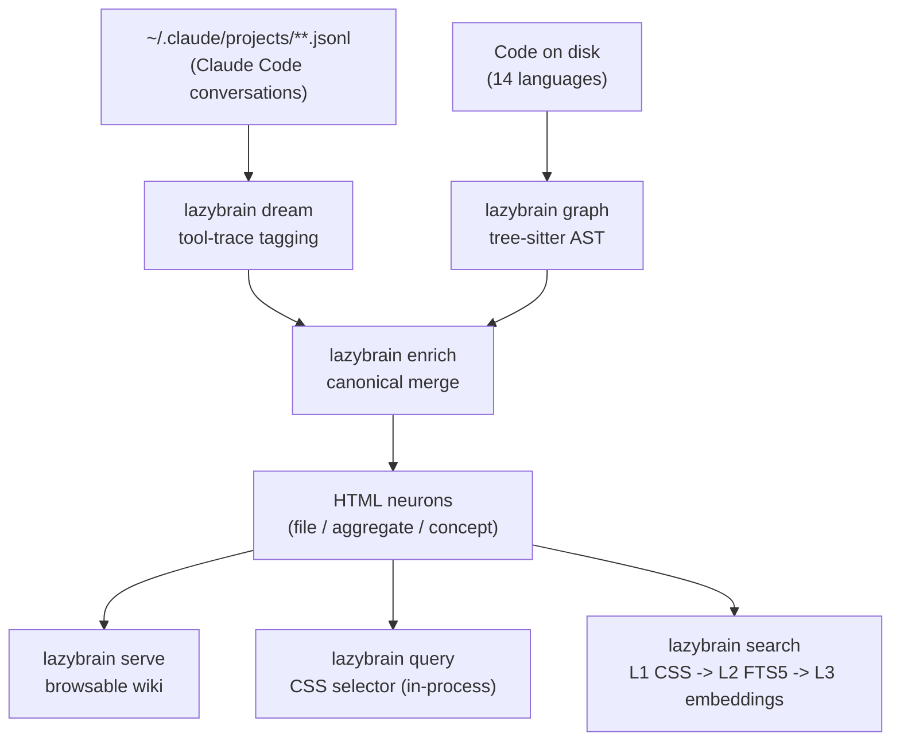

# LazyBrain

**Your code and your AI conversations, fused into a single queryable brain.**

One HTML page per source file. Fed by the decisions, bugs, and ideas from every conversation that
touched it. Retrieved by plain-text or structured queries — deterministic, $0, no LLM call, no
cloud API. Runs locally, costs nothing to query.

[](./LICENSE)
[](https://nodejs.org)
[](https://github.com/LazyGod75/LazyBrain/actions/workflows/ci.yml)
[](#key-properties)
[](#why-lazybrain)
[](./scripts/bench-determinism.mjs)

**Live demo:** https://lazygod75.github.io/LazyBrain/
**Why HTML:** https://lazygod75.github.io/LazyBrain/why-html.html

---

## The problem

Your AI coding agent forgets everything between sessions. You spend the first ten minutes of every
conversation reconstructing context: what decision you made, why you chose this library, what that
bug was. The agent re-litigates settled choices. You repeat yourself. Knowledge evaporates.

LazyBrain captures both the knowledge locked in your code and the knowledge from your conversations,
links them to the exact source files they concern, and stores everything as plain HTML on your
machine. When you or your agent needs to recall something, a CSS selector pulls back only the
relevant section in milliseconds — no LLM call, no cloud API, no subscription.

The result is a persistent second brain that gets smarter every session, costs nothing to query, and
never leaves your machine.

---

## Why LazyBrain

- **$0 per query.** CSS and FTS5 retrieval requires no LLM, no embeddings, no running server. The
  retrieval budget for a year of daily use is zero dollars.
- **Sovereign and local-first.** Your data never leaves your machine. No account. No API key. No
  external database. No outbound network calls by default. Works air-gapped.
- **Deterministic.** The same query on the same brain returns byte-identical results every run (L1
  verified by `scripts/bench-determinism.mjs`). No hallucinated recall, no non-deterministic vector
  drift.
- **Code + conversation fusion — unique in the field.** Code-graph tools cover code only. Markdown
  tools (Obsidian, basic-memory) cover notes only. LazyBrain bridges both: each file-neuron knows
  what the code does *and* why it was written that way, sourced from every conversation that touched
  it.
- **Cross-agent.** One brain shared by Claude Code and Mistral Vibe. A decision recorded in Claude
  Code is recalled inside Vibe and vice versa.
- **Git-diffable, human-readable storage.** Plain HTML files on disk. `git diff` on a neuron shows
  exactly what changed. No opaque binary index. No vendor toolchain required to inspect or audit.
- **Publishable as a static wiki.** The same files your agent queries can be deployed to GitHub
  Pages or any static host with `lazybrain publish`.

---

## Install

Requirements: Node >= 20, git.

```bash
git clone https://github.com/LazyGod75/LazyBrain.git
cd LazyBrain
npm install
npm run install:lazybrain
```

`npm run install:lazybrain` builds the CLI, runs `npm link` (exposing the `lazybrain` binary
globally), copies all skill files to `~/.claude/skills/`, and merges LazyBrain hook entries into
`~/.claude/settings.local.json`. It requires `npm install` first because `tsx` (the script runner)
is a devDependency.

**Restart Claude Code after install** so the hooks take effect.

Windows note: `npm link` may require administrator privileges on Windows. If it fails, the installer
prints a manual fallback. Hooks use the Node.js dispatcher (`_run.mjs`) by default — no Git Bash or
WSL required.

Optional — download ONNX models for semantic search (L3/L4). Without these, queries fall back to
FTS5 automatically:

```bash
npm run download-models   # ~530 MB total (bge-base + ms-marco)
```

New here? See [docs/GETTING-STARTED.md](./docs/GETTING-STARTED.md) for a 5-minute walkthrough.

---

## How it compares

### vs. your agent's built-in memory

| Feature | Claude Code auto-memory | Copilot Memory (preview) | Windsurf Memories | LazyBrain |
|---|---|---|---|---|
| Storage format | Markdown MEMORY.md | Repo-scoped (preview) | Editor-local memory ([Windsurf docs](https://docs.codeium.com/windsurf/memories)) | HTML with typed `data-cerveau-*` attributes |
| Code structure (AST, 14 languages) | NO | NO | NO | YES |
| Conversation fusion (tool-trace) | Partial | NO | NO | YES |
| Typed and temporal queries | NO | NO | NO | YES (CSS selectors, bi-temporal) |
| Cross-agent (2+ CLIs) | NO | NO | NO | YES (Claude Code + Vibe) |
| Publishable as static wiki | NO | NO | NO | YES |
| $0 per query | YES | YES | YES | YES |
| Local-first | YES | NO | Partial | YES |

Claude Code's auto-memory is useful and zero-setup — it captures context automatically.
LazyBrain's value is different: a structured, typed, auditable knowledge store that fuses
AST-level code understanding with full conversation history, queryable by CSS selector,
shareable as a website, and independent of any single agent CLI.

### vs. memory products

| | Obsidian | mem0 | Zep/Graphiti | cognee | Letta | khoj | LazyBrain |
|---|---|---|---|---|---|---|---|
| Source code input (AST) | plugin only | NO | NO | NO | NO | NO | YES (14 langs) |
| AI conversation history | NO | partial | YES | NO | YES | NO | YES (tool-trace) |
| Code + conversation fusion | NO | NO | NO | NO | NO | NO | YES (unique) |
| Storage: plain files on disk | YES (Markdown) | NO | NO (graph DB) | NO | NO | partial | YES (HTML) |
| CSS structural queries ($0, in-process) | plugin only | NO | NO | NO | NO | NO | YES |
| Typed and temporal attributes | plugin only | partial | YES | NO | NO | NO | YES (bi-temporal) |
| LLM call required to query | NO | YES | YES | YES | YES | partial | NO |
| Deterministic output | YES | NO | NO | NO | NO | NO | YES (L1 verified) |
| Requires external DB | NO | YES | YES (Neo4j) | YES | YES | YES | NO |
| Local-first | YES | partial | partial | YES | partial | YES | YES |

| System | Query latency | LLM required | Cost per query |
|---|---|---|---|
| mem0 | p50 0.708 s / p95 1.44 s (published) | YES | ~$0.001-0.01 |
| Zep/Graphiti e2e | 2.58–3.20 s (arXiv:2501.13956) | YES | cloud API + Neo4j |
| LazyBrain L1 | sub-50 ms in-process (sample brain) | NO | $0 |
| LazyBrain L2 (FTS5) | < 30 ms typical (sample brain) | NO | $0 |

Where LazyBrain leads: $0 query cost, byte-identical L1 outputs (verified), deterministic L2, exact
typed/temporal filtering (100% precision by construction for structural CSS queries), no external
DB, unique code+conversation fusion. Where it lags: no published accuracy numbers on LoCoMo,
LongMemEval, or DMR; pre-launch vs. established competitors with 17k-57k stars; no PDF or web-page
ingestion yet.

Full evidence-based matrix with citations:
[docs/COMPARISON-vs-second-brains.md](./docs/COMPARISON-vs-second-brains.md).

---

## Quick Start

```bash
# Initialize a brain
lazybrain init

# Build the brain (full pipeline)
lazybrain dream --pretty          # conversations -> notes
lazybrain index-rebuild           # build FTS5 index (enables search after dream)
lazybrain graph --pretty          # code -> file/module/project neurons
lazybrain enrich --pretty         # wire conversation knowledge onto neurons
lazybrain build-hierarchy --pretty   # optional: build navigable hierarchy
lazybrain enrich-hierarchy --pretty  # optional: enrich hierarchy nodes
lazybrain index-rebuild           # rebuild index to include enriched content

# Use it
lazybrain serve                   # browse at http://127.0.0.1:4242
lazybrain search "auth bugs" --top 5 --strip
lazybrain query 'article[data-cerveau-type="decision"]:not([data-cerveau-valid-until])'
```

First run scans all conversations and code. Timing: under 50 conversations (under 10 s), 500+ (5-10
min), 3000+ (10-20 min). After that, runs are incremental — SHA-256 fingerprints skip everything
unchanged.

### A short example

```bash
# CSS query — deterministic, $0, in-process
$ lazybrain query 'article[data-cerveau-type="decision"]:not([data-cerveau-valid-until])'
db-choice-postgres-3
  Postgres chosen over SQLite for the main service
  ...

oauth-migration-12
  Migration to OAuth2 PKCE
  ...

# Full-text search with surgical strip (returns only matched sections)
$ lazybrain search "authentication decision" --strip --top 3
· 2026-05-15 #concept-decision-oauth2-pkce-mig  (concept, decision, acme, auth)
  Decision: Migrate from JWT to OAuth2 PKCE — Confidence 0.9 — 2026-05-15
  Migrated authentication from custom JWT tokens to OAuth2 PKCE after Q2 security audit

# Time-travel — reconstruct brain state at a past date (Claude Code skill only)
# Use: /lazybrain-time-travel 2026-04-01
# Internally runs lazybrain query with data-cerveau-valid-from/until CSS filters.
# There is no `lazybrain time-travel` CLI subcommand.
```

Sample output is from the bundled `examples/sample-brain` (53 neurons). Reproduce:
`node scripts/run-benchmark.mjs`.

---

## Claude Code skills

| Skill | Purpose |
|---|---|
| `/lazybrain-dream-init` | One-time bootstrap from all past conversations |
| `/lazybrain-graph` | Scan code and conversations, build the graph |
| `/lazybrain-understand` | Enrich hierarchy nodes from conversations and code |
| `/lazybrain-search` | Full-text and semantic search |
| `/lazybrain-query` | Deterministic CSS-selector query — $0, no LLM, in-process |
| `/lazybrain-recall` | Pull specific sections of prior work |
| `/lazybrain-summary` | Brain stats and overview |
| `/lazybrain-time-travel` | Reconstruct brain state at a past date |
| `/lazybrain-validate` | End-to-end pipeline validation: wipes brain, runs full pipeline 3 times, asserts deterministic output |

---

## Mistral Vibe

LazyBrain treats Claude Code and Mistral Vibe as first-class sources. One brain, both agents.

Prerequisites: Vibe CLI installed and authenticated, `MISTRAL_API_KEY` exported, `lazybrain init`
already run.

```bash
lazybrain init --agent vibe --enable-hooks --tools --explore
```

What you get:

- **Live capture** after every agent turn (experimental hooks, exit-0-safe)
- **Batch ingestion** via `lazybrain dream --agent vibe` — sessions, subagent logs, plans, prompt
  history
- **Compaction-lineage recovery** — the brain keeps what Vibe's `/compact` destroys
- **Auto-refreshed AGENTS.md** after live captures (debounced, 300 s default); manual
  `lazybrain export-agents-md` required after batch dream runs
- **`/lazybrain-*` slash commands** available via `~/.agents/skills`
- **Spatial recall** — TUI-only: memory surfaces when the model opens a known file (inert in Vibe's
  ACP/editor loop)
- **Extraction backends** — local devstral ($0, offline), Mistral cloud, or any OpenAI-compatible
  endpoint via `LAZYBRAIN_EXTRACTOR`

Full guide: [docs/VIBE.md](./docs/VIBE.md)

---

## Benchmarks

**Sample-brain, 53 neurons, 5 queries, `tiktoken cl100k_base`:**

| Format | Avg tokens / query | Avg recall | Avg tokens / correct result | Avg precision |
|---|---|---|---|---|
| HTML-generic | 1,087 | 80% | 544 | 67% |
| Markdown whole-note | 435 | 80% | 205 | 73% |
| LazyBrain `search --strip` | 254 | 80% | 119 | 74% |

Headline: **1.7x fewer tokens than Markdown whole-note at equal 80% recall** on the bundled sample
corpus. `lazybrain search --strip` returns only the query-matched section, not the whole file.

Reproduce: `node scripts/run-benchmark.mjs` — runs on the bundled `examples/sample-brain`, no
setup, no private data.

What the numbers do and do not show: these figures come from one reproducible 53-neuron corpus
aligned to the query terminology. LazyBrain has not been evaluated on LoCoMo, LongMemEval, or DMR.
The "1.7x" is a token-count comparison at equal recall — not an accuracy claim.

Full methodology, per-query breakdown, and all honest caveats: [docs/BENCHMARKS.md](./docs/BENCHMARKS.md).

---

## Typed and temporal queries — the primary differentiator

Every fact in the brain is an HTML element with `data-cerveau-*` attributes. This is the property
no other format can match: the storage schema doubles as a query language, evaluated in-process by a
spec-compliant CSS selector engine with 100% precision by construction for structural queries.

```css
/* Still-valid decisions only */
article[data-cerveau-type="decision"]:not([data-cerveau-valid-until])

/* Bugs in one project */
article[data-cerveau-tags~="bug"][data-cerveau-topic~="acme"]

/* Decisions from this month */
article[data-cerveau-type="concept"][data-cerveau-created>="2026-05-01"]
```

A CSS predicate cannot return a non-matching element. Markdown cannot express these filters at all —
keyword-grep on "decision" returns every file that mentions the word. Vector stores have no native
type or lifecycle model.

Precision claims above apply to typed/structural queries — not to open-domain QA.

---

## Retrieval levels

The router picks the cheapest level that fits the query. All levels cost $0.

| Level | Mechanism | Typical latency | Auto-selected when |
|---|---|---|---|
| L1 | CSS selector over `data-cerveau-*` attributes | sub-50 ms in-process | Query is a CSS selector or matches a known type/tag/path |
| L2 | SQLite FTS5 (BM25 + structural-field boost) | < 30 ms (sample brain) | Query has 5 tokens or fewer |
| L2+L3 hybrid | RRF fusion of FTS5 and bi-encoder (parallel) | 150-300 ms | Query has 6-15 tokens |
| L3 | Local ONNX bi-encoder (bge-base, vectors cached) | ~150 ms warm | Longer/fuzzy queries, topK <= 5 |
| L4 | Local ONNX cross-encoder (ms-marco), re-ranks top-50 from L3 | +50 ms on L3 | topK > 5 or explicit `--mode l4` |

When ONNX models are absent, L3/L4 degrade to L2 automatically with a one-time stderr hint. L5 LLM
re-rank was in early design documents and is not implemented.

---

## Pipeline (overview)



Three neuron types, all HTML, all linked:

- **file-neuron** — one page per source file, built from tree-sitter AST (14 languages). Enriched
  with decisions/bugs/ideas from conversations that edited it.
- **aggregate-neuron** — one page per directory and per project, linking down to its children. The
  navigation backbone.
- **concept-neuron** — a decision or idea spanning multiple files, linked to every neuron it relates
  to.

---

## Key properties

- **Generic / zero-config.** Brain path resolves in order: `--brain` flag > `LAZYBRAIN_BRAIN_PATH`
  env > walk-up from cwd > `~/Documents/Lazy-Brain*/` scan > `~/.lazybrain/brain` default.
- **Local and private. Zero outbound network calls by default.** L1 and L2 make zero network calls
  ever. L3/L4 require local ONNX models (~530 MB total, bge-base + ms-marco). Run
  `npm run download-models` once (explicit user action). Set `LAZYBRAIN_ALLOW_REMOTE_MODELS=0` for
  air-gapped environments.
- **Incremental.** SHA-256 + mtime fingerprints — only changed conversations and files are
  reprocessed.
- **Bi-temporal.** Every fact carries `data-cerveau-valid-from` and `data-cerveau-valid-until`. Past
  brain state is recoverable via the `/lazybrain-time-travel` Claude Code skill, which issues
  `lazybrain query` with CSS `data-cerveau-valid-from`/`valid-until` filters. There is no
  `lazybrain time-travel` CLI subcommand.
- **Deterministic.** L1 results are byte-identical across runs (verified). L2 is deterministic by
  SQLite ORDER BY semantics.

---

## Live demo

The `demo/` directory is a self-contained, fully fictional example brain — an "Acme" SaaS backend
(~60 notes across 8 TypeScript source files). Open any file page and you see the code structure
(imports, exports, symbols) and the decisions, bugs, and ideas extracted from the conversations that
touched that file — each with a `[source]` link back to the originating conversation.

Live site: **https://lazygod75.github.io/LazyBrain/**

Read the thesis: **https://lazygod75.github.io/LazyBrain/why-html.html**

Browse the demo locally (the SPA requires a server, not `file://`):
`npx serve demo` or `python -m http.server 8080 -d demo`.

---

## Documentation

| Document | Purpose |
|---|---|
| [docs/GETTING-STARTED.md](./docs/GETTING-STARTED.md) | 5-minute walkthrough: install, first brain, first query |
| [docs/CLI-REFERENCE.md](./docs/CLI-REFERENCE.md) | All CLI commands and subcommands with options |
| [docs/STATUS.md](./docs/STATUS.md) | Feature/command status: implemented, experimental, planned, retired |
| [docs/WHY-HTML.md](./docs/WHY-HTML.md) | Technical case for HTML as the LLM second-brain format |
| [docs/why-html-for-ai-memory.html](./docs/why-html-for-ai-memory.html) ([live](https://lazygod75.github.io/LazyBrain/why-html.html)) | Self-contained blog post / thesis with live CSS query demo |
| [docs/BENCHMARKS.md](./docs/BENCHMARKS.md) | Full benchmark methodology, results, and honest caveats |
| [docs/VIBE.md](./docs/VIBE.md) | Mistral Vibe integration guide |
| [docs/COMPARISON-vs-second-brains.md](./docs/COMPARISON-vs-second-brains.md) | Evidence-based comparison against Obsidian, mem0, Zep, cognee, and others |
| [CHANGELOG.md](./CHANGELOG.md) | Version history and notable changes |

---

## Limitations

- **No public QA benchmark coverage.** LazyBrain has not been evaluated on LoCoMo, LongMemEval, or
  DMR. Precision and recall numbers in this README are from the bundled 53-neuron sample corpus
  only.
- **Recall scales with brain quality.** L1 and L2 can only return what has been indexed. Sparse
  neuron coverage produces sparse results.
- **No PDF, image, or web-page ingestion.** The pipeline reads Claude Code and Mistral Vibe
  conversation transcripts and source code.
- **L3/L4 require local ONNX models** (~530 MB total). Without them, queries fall back to L2
  automatically.
- **L3/L4 are not byte-deterministic.** Floating-point arithmetic and model updates can shift
  results. Only L1 is verified byte-identical.
- **Windows hook support is limited.** The installer writes Node.js dispatcher hooks, which work
  natively in PowerShell. The example file `settings.example.json` still uses bash-based hook
  commands — see its `_instructions` field for the correct installer path.
- **Vibe spatial recall is TUI-only.** `lazybrain_read.py` works inside the Vibe TUI; it is inert
  in Vibe's ACP/editor loop.
- **No uninstall command.** Manual rollback: `npm unlink` from the repo, remove LazyBrain entries
  from `~/.claude/settings.local.json`, delete copied `~/.claude/skills/*.SKILL.md` files.

---

## Enterprise layer

The `teams/` directory is a local-first multi-user layer that orchestrates this engine via its CLI.
It adds org/teams/roles/permissions, CSV metadata stores, federated search across multiple brains,
governance with secret-scrub, and a structured audit log. This layer is an evaluation prototype —
it demonstrates how the solo engine scales to shared team contexts but is not production-ready. See
[teams/README.md](./teams/README.md).

---

## Contributing

```bash
npm run typecheck   # 0 errors
npm run lint
npm test            # full suite
```

Issues, benchmark results from your own brain, and pull requests are welcome. See
[CONTRIBUTING.md](./CONTRIBUTING.md) for guidelines.

---

## License

Apache 2.0 — see [LICENSE](./LICENSE).
